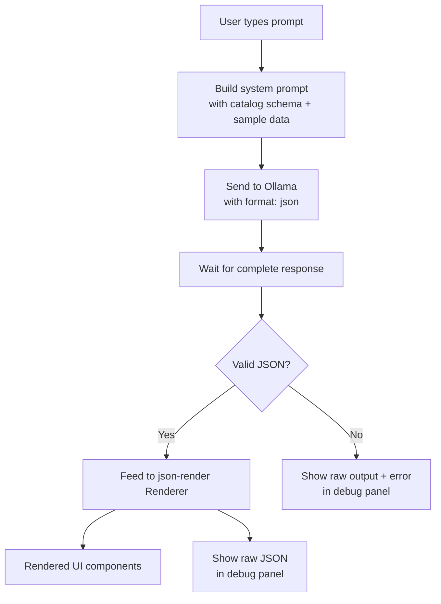

# Local-First Generative UI — Feasibility Spike

## Problem Frame

The [research document](compass_artifact_wf-5b5b0d06-c272-4ebf-a5df-b827744570a7_text_markdown.md) proposes a local-first SPA that generates UI on the fly using user-connected LLMs. Before investing in the full product vision, we need to validate the core generation loop end-to-end: can a local LLM (via Ollama) reliably produce structured JSON that maps to rendered React components in a browser?

This spike is a lab project to test feasibility and surface limitations — not to build a shippable product.

## Requirements

**Core Generation Loop**

- R1. A React SPA (Vite) with a text input where the user describes a UI they want to see (e.g., "show me a dashboard with Q1 sales by region")
- R2. The app sends the prompt to Ollama and waits for the complete response (no streaming for the spike — json-render expects JSONL patches for progressive rendering, which is incompatible with Ollama's token stream)
- R3. The LLM response is structured JSON conforming to json-render's component schema, enforced via Ollama's `format` parameter alongside the system prompt
- R4. The app renders the JSON response as display-only React components using json-render (shadcn/ui) — no interactive state or form submission

**Ollama-to-json-render Adapter**

- R5. An explicit adapter layer that: (a) builds the system prompt using json-render's `catalog.prompt()`, (b) appends sample data context in the user message, (c) calls Ollama with `format: <json-schema>` for structured output, and (d) feeds the validated response to json-render's `Renderer`. This is the core engineering of the spike.
- R6. Ollama is the sole LLM provider — connection via its OpenAI-compatible API on localhost
- R7. The model to use is configured via a constant or environment variable (not a runtime UI selector — the developer changes it between test runs)

**Sample Data**

- R8. The app ships with one compact hardcoded sample dataset (e.g., quarterly sales by region, ~50 rows) included as context in the user message — not the system prompt, to preserve context window for the catalog schema
- R9. Additional datasets are a stretch goal, not required for the spike

**Observability**

- R10. A debug panel alongside the rendered UI shows: (a) the raw JSON response from the LLM, (b) any Zod/json-render validation errors if the JSON doesn't conform to the catalog schema, and (c) the system prompt sent to the model

**Setup Prerequisites**

- R11. Document that Ollama must be configured with `OLLAMA_ORIGINS=http://localhost:*` for CORS to work with the Vite dev server, including the macOS-specific `launchctl setenv` command

## Success Criteria

- A developer with Ollama running locally can type a natural language prompt and see a rendered component — latency depends on model and hardware but the loop completes without manual intervention
- At least 66% of test prompts (minimum 5 tested) produce valid, renderable JSON on Llama 3 8B or equivalent. Test prompts should cover: a simple stat card, a data table, and a multi-component dashboard
- When generation fails, the debug panel shows the raw LLM output and the specific validation error, making the failure diagnosable
- We document initial observations on which models and prompt strategies produce reliable structured output

## Scope Boundaries

- No streaming — wait for complete Ollama response, then render (streaming is a future optimization)
- No persistence — generated UIs are ephemeral, lost on refresh
- No Tauri packaging — runs as a dev server in the browser
- No cloud LLM providers — Ollama only
- No user-provided data — hardcoded sample dataset only
- No authentication, multi-user, or sync features
- No security hardening (sandboxing, CSP, XSS prevention) — this is a local lab spike
- No production styling or polish — functional UI only

## Key Decisions

- **Ollama-only for LLM**: Validates the local-first promise directly. Cloud APIs can be added later if the generation loop works.
- **json-render for component mapping**: Uses a real ecosystem tool rather than hand-rolling. Tests whether its Zod-schema approach works with local model output.
- **Complete response, not streaming**: json-render's streaming uses JSONL patches emitted by a server-side adapter. Building that adapter is out of scope for a spike. Waiting for the full response is simpler and still validates the core question.
- **Ollama `format` parameter + system prompt**: Belt-and-suspenders approach to get reliable JSON from 7-8B models. The `format` parameter constrains the output structure; the system prompt from `catalog.prompt()` guides the content.
- **Hardcoded data in user message, not system prompt**: The catalog schema prompt may be substantial (36 components with Zod schemas). Sample data goes in the user message to avoid competing for system prompt context window space.
- **Debug panel over error handling**: The goal is learning, not resilience. Seeing raw output and validation errors teaches more than graceful fallbacks.

## Outstanding Questions

### Deferred to Planning

- [Affects R5][Needs research] What is the minimum component subset from json-render's catalog needed for useful dashboards? A smaller catalog means a shorter system prompt and better model compliance. Investigate whether `catalog.prompt()` can be scoped to a subset.
- [Affects R3][Needs research] How does Ollama's `format` parameter interact with json-render's schema? Can we pass the json-render Zod schema directly, or do we need to convert it to JSON Schema first?
- [Affects R5][Technical] What is the token budget breakdown: catalog prompt size + sample data size + user prompt + output tokens? Does this fit in 8K context, or do we need models with larger context windows?
- [Affects R2][Technical] What is the end-to-end latency from prompt to rendered UI on typical hardware (M-series Mac, 7-8B model)? This is itself a spike deliverable to characterize.

## Next Steps

→ `/ce:plan` for structured implementation planning
