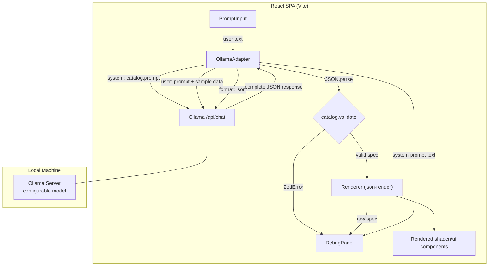

# feat: Local-first generative UI feasibility spike

## Overview

Build a minimal React SPA that validates the core generative UI loop: user prompt → Ollama (local LLM) → structured JSON → json-render → rendered shadcn/ui components. The goal is to test whether local 7-8B models can reliably produce structured UI specs, and to surface the limitations of this approach.

## Problem Frame

The [research document](docs/brainstorms/compass_artifact_wf-5b5b0d06-c272-4ebf-a5df-b827744570a7_text_markdown.md) proposes a local-first SPA that generates UI on the fly. Before investing in that vision, we need to prove the core loop works end-to-end with a local LLM. (see origin: `docs/brainstorms/2026-04-05-genui-spike-requirements.md`)

## Requirements Trace

- R1. React SPA (Vite) with text input for natural language UI prompts
- R2. Send prompt to Ollama, wait for complete response (no streaming)
- R3. LLM response is structured JSON conforming to json-render's catalog schema, guided by Ollama's `format: "json"` mode + system prompt + post-hoc validation via `catalog.validate()`
- R4. Render JSON as display-only React components via json-render + shadcn/ui
- R5. Explicit adapter layer: catalog prompt → Ollama call → validation → Renderer
- R6. Ollama-only, native `/api/chat` endpoint (deviation from origin doc's "OpenAI-compatible API" — native endpoint is simpler for direct browser `fetch` with no SDK and avoids OpenAI response format wrapping)
- R7. Model configured via constant/env var
- R8. One compact hardcoded sample dataset in user message context
- R9. Additional datasets are stretch goal
- R10. Debug panel showing raw JSON, validation errors, and system prompt
- R11. Document CORS setup for Ollama

## Scope Boundaries

- No streaming — complete response then render (see origin)
- No persistence, Tauri, cloud providers, auth, sync, security hardening, or polish (see origin)
- No production error handling — debug panel surfaces failures for learning

## Context & Research

### Relevant Code and Patterns

Greenfield repo — no existing code patterns.

### External References

- [json-render docs](https://json-render.dev/) — `defineCatalog`, `catalog.prompt()`, `catalog.jsonSchema()`, `catalog.validate()`, `Renderer`
- [json-render GitHub](https://github.com/vercel-labs/json-render) — includes Vite example confirming compatibility
- [Ollama structured outputs](https://docs.ollama.com/capabilities/structured-outputs) — `format` parameter accepts JSON Schema directly
- [Ollama API](https://github.com/ollama/ollama/blob/main/docs/api.md) — native `/api/chat` endpoint
- [Ollama issue #10001](https://github.com/ollama/ollama/issues/10001) — OpenAI-compatible endpoint has incomplete structured output; use native endpoint instead
- [shadcn/ui Vite guide](https://ui.shadcn.com/docs/installation/vite) — first-class Vite support

## Key Technical Decisions

- **Use Ollama's native `/api/chat`**, not the OpenAI-compatible endpoint: The native endpoint is simpler for direct browser `fetch` calls — no SDK needed, no OpenAI response format wrapping. The origin doc specified the OpenAI-compatible API, but the native endpoint is a better fit for a browser-only SPA with no backend.

- **Define a focused 10-component catalog**, not the full 36-component shadcn set: `catalog.prompt()` cannot filter components — scoping requires defining a smaller catalog. A 10-component catalog uses ~1,000-1,500 system prompt tokens vs ~3,000-4,000 for the full set. This leaves ample room in 8K context windows and improves model compliance. Components: Card, Metric, Table, Text, Heading, Stack, Grid, Badge (as "BarGraph" in shadcn package), Separator. Most are available in `@json-render/shadcn`; only Metric needs a custom implementation.

- **Use `format: "json"` (basic JSON mode), not `catalog.jsonSchema()`**: `catalog.jsonSchema()` cannot represent the spec's `elements` field correctly — it uses `Record<string, ...>` (dynamic keys), which JSON Schema emits as `{ additionalProperties: false }`, an empty object. Passing this to Ollama's `format` parameter would reject all actual element content. Instead, use `format: "json"` for basic JSON enforcement and rely on `catalog.prompt()` (system prompt) + `catalog.validate()` (post-hoc Zod validation) to ensure schema conformance. This is the system prompt + validation approach, not grammar-level enforcement.

- **Packages: `@json-render/core`, `@json-render/react`, `@json-render/shadcn`**: Requires Zod 4 (not 3) and React 19. Tailwind CSS via `@tailwindcss/vite` plugin.

- **json-render spec format is a flat element tree**: `{ root: string, elements: Record<string, { type, props, children? }> }`. The LLM must produce this structure, not nested JSX or component trees. The system prompt from `catalog.prompt()` describes this format.

- **Set `num_predict` (max output tokens)**: Complex dashboard specs can reach 1,500-2,500 tokens. Without setting `num_predict`, Ollama may truncate output mid-JSON, producing unparseable responses. Set to 4096 in config to provide headroom. Models with 8K+ context windows are required (Llama 3.1 8B supports 128K).

## Open Questions

### Resolved During Planning

- **Can `catalog.prompt()` be scoped to a subset?** No built-in filter. Solution: define a smaller catalog containing only the 10 components we need.
- **Can we pass json-render's schema to Ollama's `format`?** No — `catalog.jsonSchema()` cannot represent `Record` types (dynamic-key maps) in strict JSON Schema. The `elements` field emits as an empty object schema. Use `format: "json"` (basic mode) instead, with the system prompt and post-hoc validation doing the work.
- **Does the token budget work at 8K?** Yes for input. ~1,500 (catalog prompt) + ~800 (sample data) + ~100 (user prompt) = ~2,400 input tokens. Output for a simple spec is 300-600 tokens; complex dashboards may reach 1,500-2,500 tokens. Set `num_predict: 4096` to avoid truncation. Models must have 8K+ context windows.
- **Does json-render work without streaming?** Yes. `Renderer` accepts a static `spec` prop. No streaming infrastructure needed.

### Deferred to Implementation

- **Which models produce the most reliable structured output?** This is a spike deliverable — test with Llama 3.1 8B, Qwen 2.5 7B, and others as available. Document observations.
- **End-to-end latency characterization**: Depends on hardware. Measure and document during testing.
- **Whether `@json-render/shadcn` includes BarGraph with the expected props**: Research indicates it does exist as "BarGraph" (not "BarChart"). Verify during Unit 2 and adapt the catalog naming if needed.

## High-Level Technical Design

> *This illustrates the intended approach and is directional guidance for review, not implementation specification. The implementing agent should treat it as context, not code to reproduce.*

**Component catalog** (directional — ~10 components for the spike):

| Component | Purpose | Example Props |
|---|---|---|
| Card | Container with title | title, description |
| Metric | Single stat display | label, value, format |
| Table | Data table | columns, rows |
| Text | Body text | content |
| Heading | Section heading | level, content |
| Stack | Vertical layout | gap, align |
| Grid | Multi-column layout | columns, gap |
| Badge | Status indicator | label, variant |
| BarGraph | Bar visualization | data, xKey, yKey |
| Separator | Visual divider | — |

## Implementation Units

- [ ] **Unit 1: Project scaffolding**

  **Goal:** Set up the Vite + React + TypeScript project with all dependencies installed and configured.

  **Requirements:** R1 (foundation)

  **Dependencies:** None

  **Files:**
  - Create: `package.json`, `vite.config.ts`, `tsconfig.json`, `tsconfig.app.json`, `src/main.tsx`, `src/App.tsx`, `src/index.css`, `components.json`
  - Create: `README.md` — setup instructions including Ollama CORS configuration (R11)

  **Approach:**
  - Scaffold with `npm create vite@latest -- --template react-ts`
  - Install and configure: `@tailwindcss/vite`, shadcn/ui (`npx shadcn@latest init`), `@json-render/core`, `@json-render/react`, `@json-render/shadcn`, `zod` (v4)
  - Configure path aliases (`@/*`) in both tsconfig and vite config
  - Verify dev server runs and renders a placeholder page
  - README documents: Ollama installation, `OLLAMA_ORIGINS` CORS configuration (including macOS `launchctl setenv` command), required model pull command

  **Patterns to follow:**
  - [shadcn/ui Vite installation guide](https://ui.shadcn.com/docs/installation/vite)
  - json-render Vite example from the repo

  **Test expectation:** none — pure scaffolding with no behavioral code

  **Verification:**
  - `npm run dev` starts without errors
  - Placeholder page renders in browser
  - TypeScript compilation succeeds with `npm run build`

- [ ] **Unit 2: Component catalog and registry**

  **Goal:** Define the focused 10-component catalog with Zod schemas and map each to a React component implementation.

  **Requirements:** R3, R4, R5(a)

  **Dependencies:** Unit 1

  **Files:**
  - Create: `src/catalog/catalog.ts` — catalog definition with `defineCatalog`
  - Create: `src/catalog/registry.tsx` — registry mapping catalog entries to React components via `defineRegistry`
  - Create: `src/catalog/components/Metric.tsx` — custom Metric component (the only one not in `@json-render/shadcn`)
  - Test: `src/catalog/__tests__/catalog.test.ts`

  **Approach:**
  - Use `defineCatalog` from `@json-render/core` with the schema from `@json-render/react/schema`
  - Define Zod schemas for each of the 10 components (Card, Metric, Table, Text, Heading, Stack, Grid, Badge, BarGraph, Separator)
  - Most components (Card, Table, Text, Heading, Stack, Grid, Badge, BarGraph, Separator) should be available from `@json-render/shadcn` — use `shadcnComponentDefinitions` and `shadcnComponents` from the package. Note: charts are "BarGraph" not "BarChart" in the shadcn package
  - Implement only Metric as a custom component
  - Use `defineRegistry` from `@json-render/react` to map catalog entries to React component implementations
  - Export `catalog` (for prompt generation) and `registry` (for rendering)
  - Verify `catalog.prompt()` produces a reasonable system prompt (no arguments — `mode: "standalone"` does not exist)
  - Also evaluate `buildUserPrompt()` from `@json-render/core` for user message construction — it may provide format instructions that improve model compliance

  **Patterns to follow:**
  - json-render `defineCatalog` and `defineRegistry` API from official docs
  - `@json-render/shadcn` package exports for pre-built component definitions

  **Test scenarios:**
  - Happy path: `catalog.prompt()` returns a non-empty string containing all 10 component names
  - Happy path: `Renderer` with `registry` renders a hardcoded valid spec without errors (smoke test — validates the full catalog→registry→render chain)

  **Verification:**
  - All catalog tests pass
  - A hardcoded spec renders visually in the browser when passed to `Renderer` with the registry

- [ ] **Unit 3: Ollama adapter**

  **Goal:** Build the adapter that constructs the LLM request, calls Ollama, parses the response, and validates it against the catalog.

  **Requirements:** R2, R3, R5, R6, R7, R8

  **Dependencies:** Unit 2

  **Files:**
  - Create: `src/adapter/ollama.ts` — core adapter: build messages, call Ollama, parse and validate
  - Create: `src/adapter/sample-data.ts` — hardcoded sample dataset (quarterly sales by region, ~50 rows)
  - Create: `src/adapter/config.ts` — model name constant, Ollama base URL, `num_predict` setting
  - Test: `src/adapter/__tests__/ollama.test.ts`

  **Approach:**
  - The adapter is a single async function: `generateUI(prompt: string) => Promise<GenerationResult>`
  - `GenerationResult` is a discriminated union: `{ status: "success", spec, rawJson, systemPrompt }` or `{ status: "error", rawResponse, error, systemPrompt }`
  - Build the system message using `catalog.prompt()` (no arguments — `mode: "standalone"` does not exist)
  - Build the user message: user's prompt + sample data context. Evaluate whether `buildUserPrompt()` from `@json-render/core` should be used here for format instructions
  - Call Ollama's native `/api/chat` with `stream: false`, `format: "json"` (basic JSON mode — not `catalog.jsonSchema()`, which cannot represent Record types correctly), and `options: { num_predict: 4096, temperature: 0.1 }`
  - Parse the response body: `JSON.parse(data.message.content)`
  - Validate with `catalog.validate(parsed)` — this is where schema conformance is enforced (not at the grammar level). Return success with the validated spec, or error with the ZodError
  - Handle non-JSON responses and connection errors (Ollama not running, model not found) by returning them in the error result — no throws, the caller always gets a `GenerationResult`
  - For network errors (status 0, TypeError from failed fetch), include a hint suggesting CORS configuration check
  - Model name, Ollama URL, and `num_predict` are imported from config (constants, changeable between runs)

  **Patterns to follow:**
  - [Ollama /api/chat documentation](https://github.com/ollama/ollama/blob/main/docs/api.md)

  **Test scenarios:**
  - Happy path: Given a mock Ollama response with valid JSON conforming to the catalog, `generateUI` returns `{ status: "success" }` with the validated spec
  - Happy path: The system message contains the catalog prompt text (verify it is passed through)
  - Happy path: The user message includes both the user prompt and the sample data context
  - Happy path: The request body includes `stream: false`, `format: "json"`, and `options: { num_predict: 4096, temperature: 0.1 }`
  - Error path: Ollama returns valid JSON that fails catalog validation — result is `{ status: "error" }` with the ZodError
  - Error path: Ollama returns a non-JSON string — result is `{ status: "error" }` with a parse error
  - Error path: Ollama is unreachable (connection refused) — result is `{ status: "error" }` with a network error and CORS hint
  - Edge case: Ollama returns valid JSON that is semantically degenerate (all empty strings, placeholder values) — passes validation but produces useless UI. This is a realistic failure mode for 7-8B models and should be surfaceable via the debug panel

  **Verification:**
  - All adapter tests pass
  - Manual test: with Ollama running, call `generateUI("show me a simple stat card")` from the browser console and inspect the result

- [ ] **Unit 4: App shell — prompt input, rendering, and debug panel**

  **Goal:** Wire everything together into the app UI: a prompt input, a rendering area for generated components, and a debug panel.

  **Requirements:** R1, R4, R10

  **Dependencies:** Units 2 and 3

  **Files:**
  - Modify: `src/App.tsx` — main layout with prompt input, render area, and debug panel
  - Create: `src/components/PromptInput.tsx` — text input + generate button with loading state
  - Create: `src/components/RenderArea.tsx` — wraps json-render's `Renderer` with the registry, shows placeholder when no spec
  - Create: `src/components/DebugPanel.tsx` — collapsible panel showing raw JSON (syntax highlighted or formatted), validation errors, and the system prompt sent to Ollama
  - Test: `src/components/__tests__/DebugPanel.test.tsx`

  **Approach:**
  - App layout: prompt input at the top, main content area split between rendered output (left/main) and debug panel (right/bottom)
  - PromptInput: textarea + "Generate" button. Disabled while generation is in progress. Shows a simple loading indicator during the Ollama call
  - RenderArea: when a valid spec exists, render `<Renderer spec={spec} registry={registry} />`; otherwise show an empty state message
  - DebugPanel: always visible, shows three tabs or sections: (a) Raw JSON — the `rawJson` or `rawResponse` from `GenerationResult`, formatted with `JSON.stringify(_, null, 2)`, (b) Errors — validation errors or parse errors when present, (c) System Prompt — the full system prompt text sent to Ollama
  - State management: `useState` in App.tsx — no state library needed for this spike
  - On "Generate" click: call `generateUI(prompt)`, then set spec/error state based on the result

  **Patterns to follow:**
  - shadcn/ui Card, Textarea, Button components for the app shell UI

  **Test scenarios:**
  - Happy path: DebugPanel renders formatted JSON when given a `rawJson` string
  - Happy path: DebugPanel renders validation error messages when given a ZodError
  - Happy path: DebugPanel displays the system prompt text
  - Edge case: DebugPanel handles empty/null rawJson gracefully (shows empty state)
  - Integration: Full flow — entering a prompt and clicking Generate calls `generateUI` and updates both the render area and debug panel (this can be a manual test given the Ollama dependency)

  **Verification:**
  - Debug panel renders correctly with both success and error states
  - End-to-end: type a prompt, click Generate, see rendered components and raw JSON in the debug panel
  - The full generation loop works with Ollama running locally

- [ ] **Unit 5: Test prompts and observations document**

  **Goal:** Run the defined test prompts against the spike, document results, and capture observations about model reliability and limitations.

  **Requirements:** Success criteria (66% pass rate, diagnosable failures, model observations)

  **Dependencies:** Unit 4

  **Files:**
  - Create: `docs/spike-results.md` — structured observations document

  **Approach:**
  - Define 5+ test prompts covering the success criteria range: a simple stat card, a data table showing the sample dataset, a multi-component dashboard, a layout with mixed component types, an edge case prompt (vague or complex request)
  - Run each prompt against at least Llama 3 8B (or 3.1 8B). If other models are available (Qwen 2.5 7B, Mistral 7B), test those too
  - For each prompt, record: the prompt text, whether it produced valid JSON, what rendered (or what the error was), generation time, and any observations
  - Capture overall findings: pass rate, common failure modes, model comparison notes, token usage patterns, prompt strategies that improved reliability
  - Note any surprising limitations or capabilities discovered during testing

  **Test expectation:** none — this is a manual testing and documentation activity, not automated tests

  **Verification:**
  - `docs/spike-results.md` exists with structured results for at least 5 test prompts
  - Pass/fail rate is documented
  - Recommendations for next steps based on findings

## System-Wide Impact

- **Interaction graph:** Minimal — single page app with one external dependency (Ollama on localhost). No callbacks, middleware, or observers.
- **Error propagation:** All errors are captured in `GenerationResult` and surfaced in the debug panel. No throws propagate to the user.
- **CORS dependency:** The app will fail silently if Ollama's CORS is not configured. README documents this (R11), but the adapter should also surface a helpful error message when it detects a CORS/network failure.

## Risks & Dependencies

| Risk | Mitigation |
|------|------------|
| Local 7-8B models produce unreliable JSON despite `format: "json"` + system prompt | System prompt from `catalog.prompt()` + `format: "json"` + low temperature + post-hoc `catalog.validate()`. If still unreliable, that is a valid spike finding — document the failure modes |
| `@json-render/shadcn` component names differ from expected (e.g., "BarGraph" not "BarChart") | Verify available components during Unit 2. Adapt catalog naming to match. Only Metric is expected to need custom implementation |
| Output JSON truncated due to default `num_predict` limit | Set `num_predict: 4096` explicitly. Check Ollama response `done_reason` for truncation signals |
| Zod 4 may have breaking changes vs Zod 3 patterns in documentation | json-render requires Zod 4 explicitly. Follow json-render's own examples for Zod usage rather than general Zod 3 tutorials |
| CORS errors are silent in browsers — developer may not know why it fails | README documents setup clearly (R11). Adapter detects network errors and suggests CORS check in the error message |

## Sources & References

- **Origin document:** [docs/brainstorms/2026-04-05-genui-spike-requirements.md](docs/brainstorms/2026-04-05-genui-spike-requirements.md)
- **Research document:** [docs/brainstorms/compass_artifact_wf-5b5b0d06-c272-4ebf-a5df-b827744570a7_text_markdown.md](docs/brainstorms/compass_artifact_wf-5b5b0d06-c272-4ebf-a5df-b827744570a7_text_markdown.md)
- json-render: https://json-render.dev/ and https://github.com/vercel-labs/json-render
- Ollama structured outputs: https://docs.ollama.com/capabilities/structured-outputs
- Ollama API: https://github.com/ollama/ollama/blob/main/docs/api.md
- Ollama OpenAI compat issue: https://github.com/ollama/ollama/issues/10001
- shadcn/ui Vite guide: https://ui.shadcn.com/docs/installation/vite
