# feat: Conversation-first UX with Every Layout primitives

## Overview

Restructure the app from a developer prototype (textarea + squashed 2-column layout) into a conversation-first VS Code-style layout using assistant-ui for the chat thread and Every Layout primitives for the component system. The generated UI becomes the hero in the center panel, the chat thread lives on the right, and diagnostics are hidden by default in a collapsible bottom panel.

## Problem Frame

The spike's UI has layout shift, squashed panels, no conversation flow, and always-visible diagnostics. Competitive tools (Lovable, v0, Replit) all use conversation-first layouts. The current layout primitives (Stack, Grid from shadcn) are basic Tailwind wrappers — Every Layout's intrinsic primitives (Switcher, Sidebar, Cluster, Cover) handle responsiveness algorithmically without breakpoints, making them ideal for both the app shell and LLM-generated UI. (see origin: `docs/brainstorms/2026-04-05-ux-overhaul-requirements.md`)

## Requirements Trace

- R1. VS Code-inspired 3-panel layout: left sidebar (placeholder), center (rendered UI + diagnostics), right (chat thread)
- R2. Center splits vertically: rendered UI on top, diagnostics collapsible at bottom
- R3. Responsive: below ~1024px → tabbed layout (Chat | Preview)
- R4. Left sidebar as collapsible icon rail (placeholder for future features)
- R5. assistant-ui Thread as the right panel with custom Ollama runtime
- R6. Multi-turn conversation within session (not persisted across refreshes)
- R7. Composer anchored at bottom, Enter to send, Shift+Enter for newline
- R8. Streaming status rendered within assistant message bubbles
- R9. Diagnostics hidden by default, toggle to reveal
- R10. Diagnostics tabs persist after generation (Thinking tab doesn't disappear)
- R11. Auto-scroll in diagnostics with user-scroll detection
- R12. No layout shift from status messages or phase changes
- R13. Rendered UI area stable during generation
- R14. Every Layout primitives (Stack, Box, Center, Cluster, Sidebar, Switcher, Cover, Grid) as the layout system — used in both the app shell and the LLM-generated component catalog

## Scope Boundaries

- Left sidebar content (saved views, data sources, model config) — placeholder only (see origin)
- Conversation persistence across refreshes — separate feature (see origin)
- Multi-turn adapter logic (passing message history to Ollama) — wired automatically by assistant-ui's LocalRuntime passing messages to the adapter
- No changes to the Ollama streaming/JSONL patch logic — the adapter's `generateUI` is wrapped by the assistant-ui runtime, not replaced

## Context & Research

### Relevant Code and Patterns

- `src/App.tsx` — current app shell (to be restructured)
- `src/components/PromptInput.tsx` — replaced by assistant-ui Composer
- `src/components/DebugPanel.tsx` — moves into collapsible diagnostics panel
- `src/components/RenderArea.tsx` — becomes the center panel content
- `src/adapter/ollama.ts` — `generateUI` wrapped by assistant-ui ChatModelAdapter
- `src/catalog/catalog.ts` — Every Layout components added alongside existing catalog
- `src/catalog/simple-renderer.tsx` — Every Layout components registered in COMPONENTS map

### External References

- [assistant-ui LocalRuntime docs](https://www.assistant-ui.com/docs/runtimes/custom/local)
- [assistant-ui Tool UI / Generative UI](https://www.assistant-ui.com/docs/guides/tool-ui)
- [Every Layout](https://every-layout.dev/) — primitives, CSS, composition model
- [Every Layout 2nd edition (gap-based)](https://every-layout.dev/blog/second-edition/)

## Key Technical Decisions

- **assistant-ui `useLocalRuntime` + `ChatModelAdapter`**: The adapter's `run` method is an async generator that calls Ollama, streams chunks, builds the spec via `createSpecStreamCompiler`, and yields `tool-call` content parts with the partial spec. LocalRuntime manages message history, branching, and cancellation for free.

- **Specs rendered as tool-call UI**: The adapter yields `{ type: "tool-call", toolName: "render_ui", args: { spec } }`. A registered `makeAssistantToolUI` component renders `SimpleRenderer` inline in the assistant message AND updates the center panel preview. This is how assistant-ui handles generative UI natively.

- **Every Layout via CSS custom properties + React wrappers**: Roll our own — no npm package works with React 19 + Tailwind v4. Each primitive is a thin React component that sets CSS custom properties via `style` prop. The CSS classes live in `src/index.css`. Props accept CSS length strings directly (e.g., `space="1.5rem"`), which maps naturally to json-render catalog schemas.

- **Replace existing Stack/Grid from shadcn with Every Layout versions**: The current catalog's Stack and Grid are Tailwind utility wrappers with enum-based gaps ("sm"|"md"|"lg"). The Every Layout versions accept CSS lengths directly, compose intrinsically, and add Sidebar, Switcher, Cluster, Cover, Center, Box — a richer vocabulary for the LLM.

- **App shell uses Every Layout Sidebar for the 3-panel layout**: The outer layout is a Sidebar (left sidebar fixed-width, rest fills). The center-right area is another Sidebar (content fills, chat thread fixed-width). This uses Every Layout's own primitives for the app shell, eating our own dog food.

## Open Questions

### Resolved During Planning

- **Can assistant-ui work without Vercel AI SDK?** Yes — `useLocalRuntime` + `ChatModelAdapter` is the documented path for custom backends. Single package: `@assistant-ui/react`.
- **Can assistant-ui render our specs in messages?** Yes — yield `tool-call` content parts, register `makeAssistantToolUI` to render `SimpleRenderer`.
- **Does assistant-ui work with React 19 + Vite?** Yes — React 18 and 19 are both supported. No Vite-specific issues.
- **Do Every Layout primitives conflict with Tailwind?** No — different class namespaces and CSS custom property namespaces. Tailwind utilities apply for non-layout concerns.

### Deferred to Implementation

- **Exact breakpoint for 3-panel → tabbed transition**: Start at 1024px, adjust if needed during implementation.
- **Whether to use assistant-ui's scaffolded styled components or build custom**: Try `npx assistant-ui add thread` first — it generates shadcn-compatible components. Customize if the defaults don't fit.
- **Diagnostics panel resize behavior**: Start with a simple toggle (collapsed/expanded). Add drag-to-resize if the fixed heights feel wrong.

## High-Level Technical Design

> *This illustrates the intended approach and is directional guidance for review, not implementation specification. The implementing agent should treat it as context, not code to reproduce.*

```mermaid
flowchart TB
    subgraph "App Shell (Every Layout Sidebar)"
        subgraph "Left Sidebar"
            LS[Icon Rail<br/>placeholder]
        end

        subgraph "Center (Every Layout Stack)"
            RA[RenderArea<br/>SimpleRenderer + preview]
            DP[DiagnosticsPanel<br/>collapsible, hidden default]
        end

        subgraph "Right Panel"
            subgraph "assistant-ui Thread"
                ML[Message List]
                TU[Tool UI: render_ui<br/>renders spec inline]
                CO[Composer<br/>anchored bottom]
            end
        end
    end

    subgraph "Runtime Layer"
        RT[AssistantRuntimeProvider]
        LR[useLocalRuntime]
        AD[ChatModelAdapter<br/>wraps generateUI]
    end

    CO -->|user prompt| LR
    LR -->|messages| AD
    AD -->|streaming tool-call parts| ML
    TU -->|spec update| RA
```

## Phased Delivery

### Phase 1: Every Layout Primitives
Build the layout components first — they're needed by both the catalog (LLM-generated UI) and the app shell (Phase 2).

### Phase 2: App Shell Restructure
Restructure the app using assistant-ui and Every Layout, replacing the current flat layout.

## Implementation Units

### Phase 1: Every Layout Primitives

- [x] **Unit 1: Every Layout CSS foundation + modular scale**

  **Goal:** Add the Every Layout CSS classes and modular scale custom properties to the project.

  **Requirements:** R14 (foundation)

  **Dependencies:** None

  **Files:**
  - Modify: `src/index.css` — add modular scale custom properties and CSS classes for all 8 primitives

  **Approach:**
  - Add modular scale custom properties (--ratio, --s-5 through --s5, --measure) to `:root`
  - Add CSS classes for Stack, Box, Center, Cluster, Sidebar, Switcher, Cover, Grid following the 2nd edition (gap-based) patterns
  - Each class uses CSS custom properties (--space, --threshold, --measure, etc.) that React components will set via `style`
  - Ensure no conflicts with existing Tailwind theme variables — use plain names not `--tw-*` prefixed

  **Patterns to follow:**
  - [Every Layout CSS patterns from research](https://every-layout.dev/layouts/)

  **Test expectation:** none — pure CSS with no behavioral code

  **Verification:**
  - CSS classes added and correctly scoped
  - No Tailwind build errors

- [x] **Unit 2: Every Layout React components**

  **Goal:** Create thin React wrapper components for all 8 Every Layout primitives.

  **Requirements:** R14

  **Dependencies:** Unit 1

  **Files:**
  - Create: `src/components/layout/Stack.tsx`
  - Create: `src/components/layout/Box.tsx`
  - Create: `src/components/layout/Center.tsx`
  - Create: `src/components/layout/Cluster.tsx`
  - Create: `src/components/layout/Sidebar.tsx`
  - Create: `src/components/layout/Switcher.tsx`
  - Create: `src/components/layout/Cover.tsx`
  - Create: `src/components/layout/Grid.tsx`
  - Create: `src/components/layout/index.ts` — barrel export
  - Test: `src/components/layout/__tests__/layout.test.tsx`

  **Approach:**
  - Each component is a thin wrapper: accepts props (space, threshold, etc. as CSS length strings), applies the CSS class, and sets CSS custom properties via the `style` prop
  - All components accept `className` for Tailwind/additional styling and `children`
  - Sidebar component accepts `side` prop ("left"|"right") and renders two slot children
  - Cover component accepts `centered` selector for the principal element

  **Patterns to follow:**
  - Every Layout CSS custom property pattern from research

  **Test scenarios:**
  - Happy path: Stack renders children with the `stack` CSS class and `--space` custom property
  - Happy path: Sidebar renders two children with correct class names
  - Happy path: Switcher applies `--threshold` custom property
  - Happy path: All 8 components render without errors with default props

  **Verification:**
  - All components render without errors
  - CSS custom properties are applied correctly via the `style` attribute
  - Components compose (e.g., Stack inside Sidebar) without layout conflicts

- [x] **Unit 3: Register Every Layout components in catalog + SimpleRenderer**

  **Goal:** Add Every Layout primitives to the json-render catalog so the LLM can generate specs using them. Register in SimpleRenderer for rendering. Replace existing Stack/Grid definitions.

  **Requirements:** R14

  **Dependencies:** Unit 2

  **Files:**
  - Modify: `src/catalog/catalog.ts` — replace shadcn Stack/Grid definitions with Every Layout versions, add Center, Cluster, Sidebar, Switcher, Cover, Box
  - Modify: `src/catalog/simple-renderer.tsx` — register Every Layout components in COMPONENTS map
  - Modify: `src/catalog/registry.tsx` — update if still referenced
  - Test: `src/catalog/__tests__/catalog.test.ts` — update component name assertions

  **Approach:**
  - Define Zod schemas for each Every Layout component. Props are CSS length strings (not enums) — e.g., `space: z.string().nullable()` instead of `gap: z.enum(["sm","md","lg"])`
  - Provide descriptions and examples that teach the LLM when to use each primitive (e.g., "Use Switcher when items should share a row on wide screens and stack on narrow screens")
  - Register the React components from `src/components/layout/` in SimpleRenderer's COMPONENTS map
  - Remove shadcn Stack/Grid imports from registry.tsx and catalog.ts — replaced by Every Layout versions

  **Patterns to follow:**
  - Existing catalog definition pattern in `src/catalog/catalog.ts`
  - Existing COMPONENTS registration in `src/catalog/simple-renderer.tsx`

  **Test scenarios:**
  - Happy path: `catalog.prompt()` contains all Every Layout component names (Stack, Box, Center, Cluster, Sidebar, Switcher, Cover, Grid)
  - Happy path: `catalog.validate()` accepts a spec using a Switcher with string props
  - Happy path: SimpleRenderer renders a spec containing nested Every Layout components

  **Verification:**
  - Catalog includes all 8 Every Layout primitives
  - Existing Metric, BarGraph, Table, Text, Heading, Badge, Separator components still work
  - A hardcoded spec using Every Layout primitives renders correctly

### Phase 2: App Shell Restructure

- [ ] **Unit 4: Install assistant-ui and create Ollama ChatModelAdapter**

  **Goal:** Install `@assistant-ui/react`, create the custom runtime adapter that wraps our existing Ollama streaming logic.

  **Requirements:** R5, R6, R8

  **Dependencies:** None (parallel with Phase 1)

  **Files:**
  - Create: `src/chat/ollama-runtime.tsx` — ChatModelAdapter + AssistantRuntimeProvider wrapper
  - Create: `src/chat/tool-ui.tsx` — `makeAssistantToolUI` for `render_ui` tool that renders specs
  - Test: `src/chat/__tests__/ollama-runtime.test.ts`

  **Approach:**
  - The ChatModelAdapter's `run` async generator: (a) extracts text from assistant-ui's ThreadMessage format, (b) builds the system prompt via `catalog.prompt()`, (c) calls Ollama's `/api/chat` with streaming, (d) feeds content chunks to `createSpecStreamCompiler`, (e) yields `tool-call` content parts with partial specs as patches accumulate, (f) yields final `tool-call` with complete spec
  - The adapter reuses the existing streaming logic from `src/adapter/ollama.ts` but restructured as an async generator that yields assistant-ui content parts instead of calling `onProgress`
  - Register `makeAssistantToolUI({ toolName: "render_ui" })` to render `SimpleRenderer` inline in messages
  - The tool UI component also calls a callback to update the center panel preview
  - Handle thinking models: yield text content parts for thinking status, tool-call parts for specs

  **Patterns to follow:**
  - assistant-ui LocalRuntime ChatModelAdapter pattern from research
  - Existing `src/adapter/ollama.ts` streaming logic

  **Test scenarios:**
  - Happy path: Adapter run with mock Ollama streaming response yields tool-call content parts with accumulated spec
  - Happy path: Thinking chunks yield text content parts before spec patches start
  - Happy path: AbortSignal cancellation stops the fetch
  - Error path: Ollama unreachable → adapter yields error text content part
  - Integration: Tool UI component receives spec from tool-call args and renders SimpleRenderer

  **Verification:**
  - assistant-ui Thread renders messages with streaming content
  - Specs appear as tool-call rendered UI in assistant messages

- [ ] **Unit 5: App shell layout with Every Layout Sidebar**

  **Goal:** Restructure App.tsx into the VS Code-inspired 3-panel layout using Every Layout's Sidebar primitive.

  **Requirements:** R1, R2, R4, R12, R13

  **Dependencies:** Units 2, 4

  **Files:**
  - Rewrite: `src/App.tsx` — 3-panel layout with AssistantRuntimeProvider
  - Create: `src/components/AppSidebar.tsx` — left icon rail (placeholder)
  - Modify: `src/components/RenderArea.tsx` — center panel content (may simplify)
  - Delete: `src/components/PromptInput.tsx` — replaced by assistant-ui Composer

  **Approach:**
  - Outer layout: Every Layout Sidebar with left sidebar (icon rail, ~48px) and content area
  - Content area: another Sidebar with center (rendered UI + diagnostics) and right panel (assistant-ui Thread, ~360px)
  - Center area: Every Layout Stack with RenderArea on top and DiagnosticsPanel below
  - Wrap everything in the OllamaRuntimeProvider from Unit 4
  - The assistant-ui Thread renders in the right panel with Composer at the bottom
  - RenderArea receives the current spec from a shared state or context — updated by the tool UI callback
  - Delete PromptInput.tsx — assistant-ui's Composer replaces it

  **Patterns to follow:**
  - Every Layout Sidebar for the nested panel structure
  - VS Code's panel arrangement (research doc's ASCII diagram)

  **Test expectation:** none — layout restructure, verified manually

  **Verification:**
  - 3-panel layout renders on desktop: left sidebar | center content | right chat
  - Generated UI appears in center panel when prompting via chat
  - No layout shift during generation
  - Left sidebar collapses cleanly

- [ ] **Unit 6: Collapsible diagnostics panel**

  **Goal:** Move the diagnostics (Raw JSON, Thinking, Errors, System Prompt) into a collapsible bottom panel in the center area.

  **Requirements:** R2, R9, R10, R11

  **Dependencies:** Unit 5

  **Files:**
  - Modify: `src/components/DebugPanel.tsx` — restructure as collapsible bottom panel
  - Modify: `src/App.tsx` — wire diagnostics toggle state

  **Approach:**
  - Toggle button at the bottom of center area: click to expand/collapse diagnostics
  - When expanded, diagnostics panel takes ~30% of center area height (adjustable via drag handle as a future enhancement)
  - All tabs persist after generation — Thinking tab shows last generation's thinking content, never disappears
  - Auto-scroll implementation: track `scrollTop + clientHeight >= scrollHeight` to detect user at bottom. On new content, scroll to bottom only if user was already at bottom. Use a ref to track this.
  - Store last active tab in component state so tab selection persists across toggle

  **Patterns to follow:**
  - VS Code terminal panel behavior
  - Existing DebugPanel tab structure

  **Test scenarios:**
  - Happy path: Toggle button shows/hides diagnostics panel
  - Happy path: Thinking tab persists after generation with last thinking content
  - Happy path: Auto-scroll works — new streaming content scrolls to bottom automatically
  - Edge case: User scrolls up during streaming → auto-scroll pauses. User scrolls back to bottom → auto-scroll resumes
  - Edge case: Tab selection persists across collapse/expand cycle

  **Verification:**
  - Diagnostics hidden by default
  - Toggle reveals/hides the panel without layout shift in the rendered UI area
  - All tabs persist after generation
  - Auto-scroll works during streaming

- [ ] **Unit 7: Responsive layout (tabbed mobile)**

  **Goal:** On screens below ~1024px, collapse the 3-panel layout into a tabbed interface.

  **Requirements:** R3

  **Dependencies:** Unit 5

  **Files:**
  - Modify: `src/App.tsx` — responsive breakpoint logic
  - Create: `src/components/MobileTabBar.tsx` — tab switcher (Chat | Preview)

  **Approach:**
  - Use a media query (or `useMediaQuery` hook) at 1024px breakpoint
  - Below breakpoint: show a tab bar at the top with "Chat" and "Preview" tabs
  - Chat tab shows the assistant-ui Thread full-width
  - Preview tab shows RenderArea full-width with diagnostics toggle below
  - Left sidebar hidden on mobile
  - Tab selection defaults to Chat on load, switches to Preview after first generation

  **Patterns to follow:**
  - Replit/v0 mobile patterns from research

  **Test expectation:** none — responsive layout, verified manually at different viewport widths

  **Verification:**
  - At 1024px+ : 3-panel layout renders correctly
  - Below 1024px: tabbed layout with Chat and Preview tabs
  - Tab switching preserves state (chat history, rendered UI)
  - Diagnostics accessible within Preview tab

- [ ] **Unit 8: Cleanup and integration test**

  **Goal:** Remove dead code, verify the full flow end-to-end, and ensure all requirements are met.

  **Requirements:** All

  **Dependencies:** Units 3, 6, 7

  **Files:**
  - Delete: `src/components/PromptInput.tsx` (if not deleted in Unit 5)
  - Modify: `src/adapter/ollama.ts` — remove `onProgress` callback pattern if fully replaced by assistant-ui runtime (or keep as a lower-level API)
  - Modify: tests as needed
  - Modify: `src/catalog/registry.tsx` — remove unused shadcn component wrappers

  **Approach:**
  - Review all files for dead imports, unused components, and stale patterns
  - Run full test suite and fix any breakage
  - Manual end-to-end test: type a prompt → chat message appears → UI generates progressively in center panel → diagnostics accessible → follow-up prompt works

  **Test scenarios:**
  - Integration: Full flow — prompt in Composer → assistant message with streaming tool-call → spec renders in center panel + tool UI in message → diagnostics show JSONL patches
  - Integration: Follow-up prompt → new assistant message → center panel updates with new spec
  - Happy path: All existing adapter and catalog tests still pass

  **Verification:**
  - No dead code or unused imports
  - All tests pass
  - Full generation loop works via the assistant-ui chat interface
  - All 13 requirements from the origin document are satisfied

## System-Wide Impact

- **Interaction graph:** assistant-ui runtime → ChatModelAdapter → Ollama adapter → `createSpecStreamCompiler` → SimpleRenderer. Tool UI bridges assistant messages to center panel via shared state/callback.
- **Error propagation:** Adapter errors surface as text content parts in assistant messages. Ollama connection failures show in the chat thread, not as separate error panels.
- **Unchanged invariants:** The Ollama streaming logic, JSONL patch compilation, catalog validation, and SimpleRenderer are not modified — only wrapped by the assistant-ui adapter. The adapter's `generateUI` function may remain as a lower-level API.

## Risks & Dependencies

| Risk | Mitigation |
|------|------------|
| assistant-ui's styled components may conflict with existing shadcn/Tailwind setup | Use `npx assistant-ui add thread` which generates shadcn-compatible components. Customize if conflicts arise |
| Every Layout CSS custom properties may conflict with Tailwind v4 theme variables | Every Layout uses plain names (--space, --measure), Tailwind uses --tw-* prefix. No conflict expected; verify in Unit 1 |
| ChatModelAdapter async generator pattern may not handle the JSONL patch → tool-call conversion cleanly | Build incrementally: start with text-only streaming, then add tool-call parts. The existing `generateUI` logic is well-tested and can be reused |
| 3-panel layout may feel cramped on 13" laptops | Every Layout Sidebar wraps automatically when space is insufficient. Set content-min appropriately. The responsive tabbed fallback covers smaller screens |
| Removing the existing PromptInput before assistant-ui is fully wired creates a broken intermediate state | Implement Unit 4 (runtime) and Unit 5 (layout) together before removing PromptInput |

## Sources & References

- **Origin document:** [docs/brainstorms/2026-04-05-ux-overhaul-requirements.md](docs/brainstorms/2026-04-05-ux-overhaul-requirements.md)
- **Ideation:** [docs/ideation/2026-04-05-genui-improvements-ideation.md](docs/ideation/2026-04-05-genui-improvements-ideation.md)
- **Vision:** [docs/vision/2026-04-05-product-vision.md](docs/vision/2026-04-05-product-vision.md)
- assistant-ui: https://www.assistant-ui.com/docs/runtimes/custom/local
- Every Layout: https://every-layout.dev/
- Related plans: `docs/plans/2026-04-05-002-feat-streaming-jsonl-patches-plan.md`
