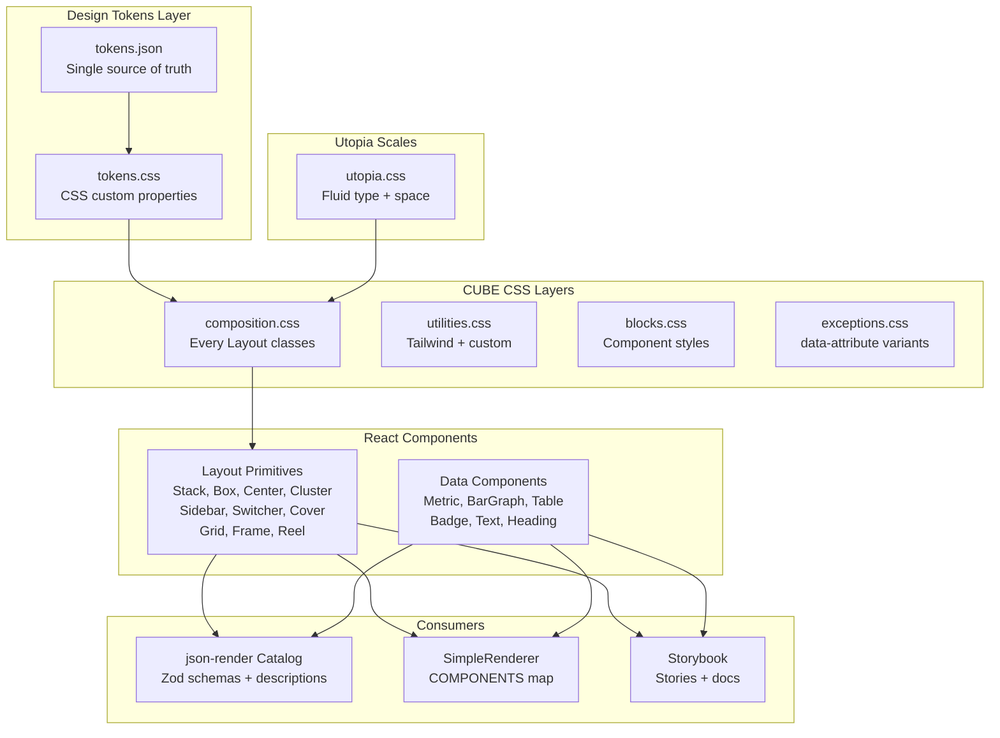

# feat: Design system foundation

## Overview

Build a coherent design system stack: design tokens (JSON → CSS custom properties), Utopia fluid type and space scales, Every Layout intrinsic primitives as React components, CUBE CSS methodology for stylesheet organization, and Storybook for component development and cataloging. This replaces the current ad-hoc Tailwind utility layout approach with a constrained, composable vocabulary that both humans and the LLM can use reliably.

## Problem Frame

The spike uses raw Tailwind utility classes for layout — infinite decision surface for the LLM (which gap? which breakpoint?) and no systematic scale for the app. The design system stack (Tokens → Utopia → Every Layout → CUBE CSS) gives the LLM a constrained vocabulary of layout primitives and spacing tokens, reducing the decision surface from infinite to ~10 layout components + ~15 spacing values. (see origin: `docs/brainstorms/2026-04-05-design-system-requirements.md`)

## Requirements Trace

- R1. Design tokens in JSON as single source of truth
- R2. Tokens consumed as CSS custom properties
- R3. Token categories: colors, spacing, typography, borders, radii, shadows
- R4. Fluid type scale from Utopia (--step--2 through --step-5)
- R5. Fluid space scale from Utopia (--space-3xs through --space-3xl + pairs)
- R6. Every Layout primitives use Utopia tokens for spacing
- R7. 10 React components: Stack, Box, Center, Cluster, Sidebar, Switcher, Cover, Grid, Frame, Reel
- R8. Props accept CSS custom property values (intrinsic design)
- R9. Primitives compose without conflicts
- R10. Primitives registered in json-render catalog
- R11. Primitives registered in SimpleRenderer
- R12. CSS organized by CUBE layers (composition → utility → block → exception)
- R13. Exceptions via data attributes
- R14. Global composition classes (.flow, etc.)
- R15. Storybook set up with stories for all primitives
- R16. Three story types: Default, Playground, Composition
- R17. Data component stories (Metric, BarGraph, Table, Badge)
- R18. Storybook as visual reference catalog

## Scope Boundaries

- Tailwind stays — CUBE CSS and Tailwind coexist (see origin)
- No adapter/streaming changes
- No assistant-ui integration
- No app shell restructure
- Icon and Imposter are optional — include if straightforward

## Context & Research

### Relevant Code and Patterns

- `src/index.css` — current stylesheet with Tailwind imports + shadcn theme variables
- `src/catalog/catalog.ts` — current 10-component catalog (Stack, Grid from shadcn + custom Metric, BarGraph)
- `src/catalog/simple-renderer.tsx` — COMPONENTS map with inline layout components
- `.every-layout/` — reference implementations (React + web component versions) for conceptual guidance

### External References

- [Every Layout](https://every-layout.dev/) — 2nd edition CSS patterns (gap-based)
- [CUBE CSS](https://cube.fyi/) — Composition, Utility, Block, Exception methodology
- [Utopia](https://utopia.fyi/) — fluid type and space calculator
- [buildexcellentwebsit.es](https://buildexcellentwebsit.es/) — unified philosophy
- [Design Tokens](https://piccalil.li/blog/what-are-design-tokens/) — token patterns

## Key Technical Decisions

- **Straight replacement of shadcn Stack/Grid**: The Every Layout versions use CSS-length props (`space="var(--space-m)"`) vs shadcn's enum props (`gap: "sm"`). Aliasing would create confusion. Replace cleanly in catalog and renderer.

- **Plain CSS classes per CUBE methodology**: Global `.stack`, `.sidebar`, `.cluster` classes in `src/index.css`. React components set CSS custom properties via `style` prop. No CSS Modules, no CSS-in-JS. Switcher uses a rendered `<style>` element for dynamic nth-child selectors.

- **Utopia calculator output pasted as CSS**: Generate once via utopia.fyi, paste into `src/styles/utopia.css`. Settings: 320-1240px viewport, 16-20px base, 1.2-1.25 ratios, steps -2 to +5.

- **Token JSON is documentation-first**: The JSON file documents all tokens. A companion CSS file maps them to custom properties. No build step — manual sync is fine at this scale.

- **CUBE CSS layering in stylesheet**:
  1. `src/styles/tokens.css` — design token custom properties
  2. `src/styles/utopia.css` — Utopia fluid scales
  3. `src/styles/composition.css` — Every Layout composition classes + .flow
  4. `src/styles/utilities.css` — Tailwind + custom utility classes
  5. `src/styles/blocks.css` — component-specific styles (Card, Metric, etc.)
  6. `src/styles/exceptions.css` — data-attribute-driven variants

## Open Questions

### Resolved During Planning

- **Catalog reconciliation**: Straight replacement — remove shadcn Stack/Grid definitions and imports, replace with Every Layout versions. The component names are the same (Stack, Grid) so the LLM prompt vocabulary doesn't change — only the prop shapes change (enum → CSS-length strings).
- **Storybook + Vite + React 19**: Storybook 8.x supports Vite natively and React 19. Install via `npx storybook@latest init`.

### Deferred to Implementation

- **Exact Utopia calculator output**: Generate during Unit 1 by visiting utopia.fyi with the agreed settings. The exact clamp() values depend on the calculator's current implementation.
- **Whether Frame and Reel need catalog registration**: They may not be useful for dashboard-style generated UIs. Register them in the component library for app use, but defer catalog registration until the LLM actually needs them.

## High-Level Technical Design

> *This illustrates the intended approach and is directional guidance for review, not implementation specification. The implementing agent should treat it as context, not code to reproduce.*

## Phased Delivery

### Phase 1: Tokens + Scales + CSS Foundation
Design tokens, Utopia scales, and CUBE CSS stylesheet structure. No React components yet — just the CSS foundation.

### Phase 2: Every Layout React Components
10 layout primitives as React components using the CSS foundation.

### Phase 3: Catalog + Renderer Integration
Register primitives in json-render catalog and SimpleRenderer. Replace shadcn Stack/Grid.

### Phase 4: Storybook
Set up Storybook, write stories for all components.

## Implementation Units

### Phase 1: Tokens + Scales + CSS Foundation

- [x] **Unit 1: Design tokens JSON + CSS custom properties**

  **Goal:** Create the design token JSON file and its companion CSS file with all custom properties.

  **Requirements:** R1, R2, R3

  **Dependencies:** None

  **Files:**
  - Create: `src/tokens/tokens.json`
  - Create: `src/styles/tokens.css`

  **Approach:**
  - Define token categories in JSON: colors (brand: dark, light, primary, destructive, muted; semantic: background, foreground, card, border), spacing (references to Utopia scale names), typography (font families, weights), borders (widths, radii), shadows
  - Map each token to a CSS custom property in `tokens.css` with `--token-` prefix for clarity (e.g., `--color-primary`, `--radius-md`)
  - Keep the existing shadcn theme variables (--background, --foreground, etc.) — tokens can reference them or eventually replace them
  - Use W3C-compatible naming: dash-separated, categorized

  **Patterns to follow:**
  - Existing shadcn theme variables in `src/index.css` (for naming compatibility)
  - [Design token patterns from research](https://piccalil.li/blog/what-are-design-tokens/)

  **Test expectation:** none — pure design data with no behavioral code

  **Verification:**
  - `tokens.json` contains all categories (colors, spacing, typography, borders, radii, shadows)
  - `tokens.css` defines CSS custom properties that can be imported

- [x] **Unit 2: Utopia fluid type and space scales**

  **Goal:** Generate Utopia fluid scales and add them as CSS custom properties.

  **Requirements:** R4, R5

  **Dependencies:** Unit 1

  **Files:**
  - Create: `src/styles/utopia.css`

  **Approach:**
  - Visit utopia.fyi/type/calculator with settings: min viewport 320px, max 1240px, min font 16px, max font 20px, min ratio 1.2, max ratio 1.25, 5 positive + 2 negative steps
  - Visit utopia.fyi/space/calculator with matching viewport settings, generate space scale (3xs through 3xl) with fluid pairs (s-l, m-xl, etc.)
  - Paste the generated CSS into `utopia.css`
  - The file contains `:root` custom properties: `--step--2` through `--step-5` for type, `--space-3xs` through `--space-3xl` for space

  **Patterns to follow:**
  - [Utopia calculator output format](https://utopia.fyi/)

  **Test expectation:** none — generated CSS values

  **Verification:**
  - Type steps from --step--2 to --step-5 defined
  - Space values from --space-3xs to --space-3xl defined
  - All values use `clamp()` for fluid scaling

- [x] **Unit 3: CUBE CSS stylesheet structure**

  **Goal:** Reorganize the CSS into CUBE layers and add global composition rules.

  **Requirements:** R12, R14

  **Dependencies:** Units 1, 2

  **Files:**
  - Create: `src/styles/composition.css` — Every Layout CSS classes + .flow utility
  - Create: `src/styles/blocks.css` — placeholder for component-specific styles
  - Create: `src/styles/exceptions.css` — placeholder for data-attribute variants
  - Modify: `src/index.css` — restructure imports to follow CUBE layer order

  **Approach:**
  - `composition.css`: Add all Every Layout CSS classes (.stack, .box, .center, .cluster, .sidebar, .switcher, .cover, .grid, .frame, .reel) following the 2nd edition gap-based patterns from the research
  - Add `.flow > * + *` composition class using `--flow-space` custom property
  - `index.css` import order: Tailwind → tokens.css → utopia.css → composition.css → (utilities via Tailwind) → blocks.css → exceptions.css
  - `blocks.css` and `exceptions.css` start as near-empty files with comments explaining their CUBE CSS purpose

  **Patterns to follow:**
  - Every Layout 2nd edition CSS from research
  - CUBE CSS composition layer from research
  - Reference implementations in `.every-layout/` for CSS patterns

  **Test expectation:** none — CSS structure

  **Verification:**
  - All 10 Every Layout CSS classes defined in composition.css
  - `.flow` composition class defined
  - `index.css` imports follow CUBE layer order
  - No build errors

### Phase 2: Every Layout React Components

- [x] **Unit 4: Every Layout React components (all 10)**

  **Goal:** Create React wrapper components for all 10 Every Layout primitives.

  **Requirements:** R7, R8, R9, R6

  **Dependencies:** Unit 3

  **Files:**
  - Create: `src/components/layout/Stack.tsx`
  - Create: `src/components/layout/Box.tsx`
  - Create: `src/components/layout/Center.tsx`
  - Create: `src/components/layout/Cluster.tsx`
  - Create: `src/components/layout/Sidebar.tsx`
  - Create: `src/components/layout/Switcher.tsx`
  - Create: `src/components/layout/Cover.tsx`
  - Create: `src/components/layout/Grid.tsx`
  - Create: `src/components/layout/Frame.tsx`
  - Create: `src/components/layout/Reel.tsx`
  - Create: `src/components/layout/index.ts` — barrel export
  - Test: `src/components/layout/__tests__/layout.test.tsx`

  **Approach:**
  - Each component is a thin wrapper: applies the CSS class from composition.css + sets CSS custom properties via `style` prop
  - Props accept CSS-length strings that default to Utopia tokens (e.g., `space` defaults to `"var(--space-s)"`)
  - All components accept `className` for additional Tailwind/utility styling and `children`
  - Sidebar: accepts `side` ("left"|"right"), `sideWidth`, `contentMin`, `space` props + two children slots
  - Switcher: renders a `<style>` element for dynamic nth-child logic based on `limit` prop
  - Cover: accepts `centered` prop for the principal element selector
  - Frame: accepts `ratio` prop as "width:height" string
  - All components accept optional `data-state` or `data-variant` for CUBE CSS exceptions (R13)

  **Patterns to follow:**
  - Reference implementations in `.every-layout/` (conceptual guidance, not copy-paste)
  - Every Layout 2nd edition CSS patterns

  **Test scenarios:**
  - Happy path: Stack renders with `.stack` class and `--space` custom property set to the provided value
  - Happy path: Sidebar renders two child slots with correct flex properties
  - Happy path: Switcher applies dynamic nth-child CSS based on `limit` prop
  - Happy path: Grid renders with `--grid-min` custom property
  - Happy path: All 10 components render without errors with default props
  - Edge case: Stack with `recursive` prop applies recursive CSS variant
  - Edge case: Sidebar with `side="right"` reverses child order
  - Integration: Stack inside Sidebar renders without layout conflicts — flex directions don't compete

  **Verification:**
  - All 10 components render and apply correct CSS classes
  - CSS custom properties flow through to the DOM
  - Components compose (nested primitives) without visual conflicts

### Phase 3: Catalog + Renderer Integration

- [x] **Unit 5: Register primitives in catalog + SimpleRenderer**

  **Goal:** Add Every Layout primitives to the json-render catalog and SimpleRenderer. Replace shadcn Stack/Grid.

  **Requirements:** R10, R11

  **Dependencies:** Unit 4

  **Files:**
  - Modify: `src/catalog/catalog.ts` — replace shadcn Stack/Grid with Every Layout versions, add Center, Cluster, Sidebar, Switcher, Cover, Box, Frame, Reel
  - Modify: `src/catalog/simple-renderer.tsx` — replace inline Stack/Grid with imported Every Layout components, add new primitives
  - Modify: `src/catalog/registry.tsx` — remove shadcn wrappers if still referenced
  - Modify: `src/catalog/__tests__/catalog.test.ts` — update component name assertions
  - Test: `src/catalog/__tests__/catalog.test.ts`

  **Approach:**
  - Zod schemas for each primitive use `z.string().nullable()` for CSS-length props (space, threshold, etc.) — not enums
  - Descriptions teach the LLM when to use each primitive (critical for generation quality):
    - Stack: "Vertical flow with consistent spacing between children"
    - Sidebar: "Two-panel layout — sidebar has fixed ideal width, content fills remaining space. Wraps to stacked on narrow screens."
    - Switcher: "Equal-width row that automatically stacks when container is too narrow. Use instead of Grid when all items should be equal width."
    - etc.
  - Examples use Utopia token names: `{ space: "var(--space-m)" }`
  - Remove `shadcnComponentDefinitions.Stack` and `shadcnComponentDefinitions.Grid` imports
  - Keep `shadcnComponentDefinitions.Card`, `.Table`, `.Text`, `.Heading`, `.Badge`, `.Separator` — these are data/content components, not layout

  **Patterns to follow:**
  - Existing catalog definition pattern in `src/catalog/catalog.ts`

  **Test scenarios:**
  - Happy path: `catalog.prompt()` contains all Every Layout component names
  - Happy path: `catalog.validate()` accepts a spec using Sidebar with string props
  - Happy path: SimpleRenderer renders a spec containing nested layout primitives (Stack in Sidebar)
  - Happy path: Existing data components (Metric, BarGraph, Table) still render correctly after the replacement
  - Edge case: Spec with only a Center containing a Heading — minimal layout renders

  **Verification:**
  - Catalog includes all layout primitives with Utopia-aware descriptions
  - LLM-generated specs using the new primitives render correctly
  - No regressions in existing data component rendering

### Phase 4: Storybook

- [x] **Unit 6: Storybook setup**

  **Goal:** Initialize Storybook for the project with Vite + React 19.

  **Requirements:** R15

  **Dependencies:** None (can run in parallel with other units)

  **Files:**
  - Create: `.storybook/main.ts`
  - Create: `.storybook/preview.ts`
  - Modify: `package.json` — storybook dev dependencies

  **Approach:**
  - Initialize with `npx storybook@latest init` (auto-detects Vite + React)
  - Add `@storybook/addon-a11y` for accessibility checking
  - Configure preview.ts to import our CSS files (tokens, utopia, composition) so stories render with the design system
  - Verify Storybook dev server starts without errors

  **Patterns to follow:**
  - [Storybook Vite builder docs](https://storybook.js.org/docs/builders/vite)

  **Test expectation:** none — tooling setup

  **Verification:**
  - `npm run storybook` starts without errors
  - Default welcome page renders

- [x] **Unit 7: Layout primitive stories**

  **Goal:** Write Storybook stories for all 10 Every Layout primitives.

  **Requirements:** R15, R16

  **Dependencies:** Units 4, 6

  **Files:**
  - Create: `src/components/layout/Stack.stories.tsx`
  - Create: `src/components/layout/Box.stories.tsx`
  - Create: `src/components/layout/Center.stories.tsx`
  - Create: `src/components/layout/Cluster.stories.tsx`
  - Create: `src/components/layout/Sidebar.stories.tsx`
  - Create: `src/components/layout/Switcher.stories.tsx`
  - Create: `src/components/layout/Cover.stories.tsx`
  - Create: `src/components/layout/Grid.stories.tsx`
  - Create: `src/components/layout/Frame.stories.tsx`
  - Create: `src/components/layout/Reel.stories.tsx`

  **Approach:**
  - Three story types per primitive:
    1. **Default**: Component with sensible defaults and placeholder children
    2. **Playground**: All props exposed as Storybook controls (ArgTypes) — user can tweak space, threshold, etc. in real time
    3. **Composition**: The primitive nested with other primitives — e.g., "Sidebar containing a Stack of Cards and a Cluster of Badges"
  - Use Utopia token values in the default stories (e.g., `space: "var(--space-m)"`)
  - Use the Viewport addon to demonstrate intrinsic responsiveness — resize the preview to see Switcher stack, Sidebar wrap, Grid reflow

  **Patterns to follow:**
  - Storybook CSF3 format

  **Test expectation:** none — stories are visual tests

  **Verification:**
  - All 10 primitives have stories visible in Storybook
  - Controls work (changing props updates the preview)
  - Viewport resizing demonstrates intrinsic layout behavior

- [x] **Unit 8: Data component stories**

  **Goal:** Write Storybook stories for existing data components.

  **Requirements:** R17

  **Dependencies:** Units 6, 5

  **Files:**
  - Create: `src/catalog/components/Metric.stories.tsx`
  - Create: `src/catalog/components/BarGraph.stories.tsx`
  - Create: `src/components/layout/data-stories/Table.stories.tsx`
  - Create: `src/components/layout/data-stories/Badge.stories.tsx`

  **Approach:**
  - Default story with realistic sample data
  - Playground story with all props as controls
  - These stories use Every Layout primitives for composition (e.g., Grid of Metrics, Stack of Tables) — demonstrating how data components compose within the layout system

  **Patterns to follow:**
  - Layout primitive story patterns from Unit 7

  **Test expectation:** none — stories are visual tests

  **Verification:**
  - All data components visible in Storybook with interactive controls
  - Composition stories show data components inside layout primitives

## System-Wide Impact

- **Interaction graph:** The catalog's `prompt()` output changes — the system prompt will describe Every Layout primitives instead of shadcn Stack/Grid. This affects what the LLM generates.
- **Unchanged invariants:** Ollama adapter, JSONL patch streaming, SimpleRenderer's rendering logic, and the DebugPanel are not modified. Only the COMPONENTS map entries and catalog definitions change.
- **API surface parity:** The json-render catalog is the interface between the LLM and the renderer. Changing component definitions means the LLM will generate different specs. Existing saved specs (if any were persisted) would break — but persistence doesn't exist yet, so this is safe.

## Risks & Dependencies

| Risk | Mitigation |
|------|------------|
| Storybook 8.x may have issues with React 19.2.x | Storybook 8.x officially supports React 19. If issues arise, pin to a known-working Storybook version |
| Utopia clamp() values may conflict with Tailwind v4 theme | Utopia uses `--step-*` and `--space-*` names; Tailwind uses `--tw-*`. No namespace conflict |
| LLM may produce worse specs with the new component vocabulary | The vocabulary is more constrained (good) but different from what models were trained on. Mitigate by providing rich descriptions and examples in catalog definitions. Test with prompts after Unit 5 |
| Dynamic `<style>` in Switcher may cause SSR issues | Not a concern — this is a client-side SPA with no SSR |

## Sources & References

- **Origin document:** [docs/brainstorms/2026-04-05-design-system-requirements.md](docs/brainstorms/2026-04-05-design-system-requirements.md)
- **Reference implementations:** `.every-layout/` (React + web component versions)
- Every Layout: https://every-layout.dev/
- CUBE CSS: https://cube.fyi/
- Utopia: https://utopia.fyi/
- Build Excellent Websites: https://buildexcellentwebsit.es/
- Design Tokens: https://piccalil.li/blog/what-are-design-tokens/
- Prior plan: `docs/plans/2026-04-05-003-feat-ux-overhaul-every-layout-plan.md` (superseded Phase 1 by this more detailed plan)
