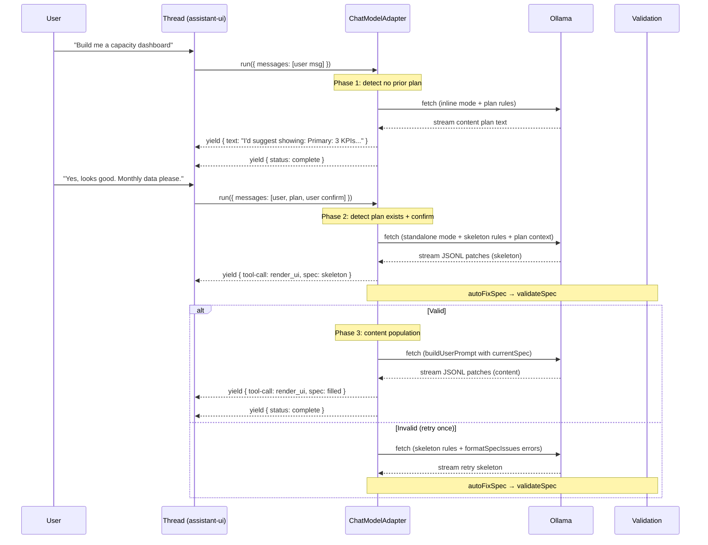

# feat: Interactive content-first generation pipeline

## Overview

Replace the single-call LLM generation with a three-phase interactive pipeline: content plan → layout + components → content population. The pipeline follows content-first design practice (content hierarchy informs layout, not the reverse), presents the content plan to the user as a conversation turn for approval, validates the skeleton spec structurally between phases, and fills in content via JSONL patches against the validated skeleton.

## Problem Frame

After expanding the catalog to 18 components, the LLM frequently produces structurally broken specs — orphaned elements, missing children, broken tree shapes. A single call must simultaneously decide content hierarchy, layout composition, and content generation. Splitting into focused phases reduces the decision surface per call and lets the user collaborate at the content plan stage. (see origin: `docs/brainstorms/2026-04-07-multi-step-generation-pipeline-requirements.md`)

## Requirements Trace

- R1. Pipeline embedded in multi-turn conversation using assistant-ui
- R2. Content plan always presented to user; user confirms before layout proceeds
- R3. Phase 1 produces structured content plan: entities, hierarchy, user tasks
- R4. Phase 1 includes targeted clarifying questions
- R5. Content plan specific enough to inform layout (concrete data elements, not abstractions)
- R6. Phase 2 produces skeleton JSONL spec with all components but empty props
- R7. Skeleton streams progressively using existing JSONL patch format
- R8. Skeleton prop format: null for layout, empty strings/arrays for content components
- R9. Structural validation: autoFixSpec → validateSpec between phases 2 and 3
- R10. Error-informed retry: validation errors in retry prompt via formatSpecIssues
- R11. Phase 3 fills props via JSONL patches against skeleton (createSpecStreamCompiler with initial)
- R12. Invalid patches silently skipped and logged
- R13. Progressive rendering during phases 2 and 3
- R14. UI indicates active pipeline phase

## Scope Boundaries

- Refinement loop is a follow-up feature (see origin)
- Few-shot examples for any phase are out of scope
- Conversation persistence across refreshes is out of scope
- Catalog changes are out of scope
- Model selection or fine-tuning is out of scope

## Context & Research

### Relevant Code and Patterns

- `src/chat/ollama-runtime.tsx` — Current ChatModelAdapter with async generator pattern. The pipeline will restructure this adapter to orchestrate three sequential Ollama calls instead of one.
- `src/chat/diagnostics-context.tsx` — DiagnosticsProvider for streaming state to debug panel. Pipeline phases will update this context with phase-specific data.
- `src/chat/tool-ui.tsx` — Tool UI syncing spec to center panel. Used unchanged in phases 2 and 3.
- `src/catalog/catalog.ts` — `catalog.prompt()` with `mode: "inline"` (conversational + JSONL) and `mode: "standalone"` (JSONL only). `customRules` for per-phase instructions.
- `@json-render/core` APIs: `validateSpec()`, `autoFixSpec()`, `formatSpecIssues()`, `createSpecStreamCompiler(initial)`, `buildUserPrompt({ prompt, currentSpec })`.

### Institutional Learnings

- Expanding the catalog from 10→18 components degraded structural quality. Decomposing into focused steps is the validated approach (see `docs/ideation/2026-04-05-genui-improvements-ideation.md`).
- `createSpecStreamCompiler` handles line buffering and patch application internally. Do not manually split lines.
- `catalog.prompt()` natively instructs the LLM to output JSONL patches. No custom system prompt engineering needed for the JSONL format itself.

## Key Technical Decisions

- **Adapter orchestrates all three phases:** The `ChatModelAdapter.run()` async generator handles the full pipeline — it makes three sequential Ollama fetch calls, yielding content parts between them. No external orchestration framework needed. (see origin: plain sequential calls)

- **Phase 1 uses `catalog.prompt({ mode: "inline" })` with custom rules:** The "inline" mode lets the LLM respond conversationally first (the content plan) and then output JSONL patches. For Phase 1 we instruct it via `customRules` to only output the content plan as conversational text, with no JSONL. The content plan is yielded as a text content part in the assistant message.

- **Phase 2 uses `catalog.prompt({ mode: "standalone", customRules })` with layout-focused instructions:** The system prompt includes the full catalog (no subsetting — the LLM needs to know all components to choose correctly) but custom rules instruct it to produce a skeleton spec with empty content props. The content plan from Phase 1 is included in the user message.

- **Phase 3 uses `buildUserPrompt({ prompt, currentSpec })` for patch-only mode:** The `currentSpec` parameter triggers json-render's edit/refinement mode. The LLM receives the skeleton spec as context and generates patches to fill in prop values.

- **User approval between Phase 1 and 2:** The adapter yields the content plan as a text part and returns with `status: complete`. assistant-ui's Thread shows the content plan as an assistant message. The user's next message (confirmation or refinement) triggers a new `run()` call. The adapter detects this is a continuation (the thread has a prior content plan message) and proceeds to Phase 2.

- **Phase detection via message history:** The adapter inspects the thread's message history to determine which phase to run. No phase: fresh content plan. Content plan exists + user confirmed: layout generation. Skeleton exists: content population.

- **Validation uses `autoFixSpec` → `validateSpec` → `formatSpecIssues`:** Between phases 2 and 3, the adapter runs auto-fix, validates, and if issues remain, retries Phase 2 once with the formatted issues in the prompt. If retry fails, yields an error text part.

## Open Questions

### Resolved During Planning

- **Content plan format:** Structured conversational text. Phase 1 uses `catalog.prompt({ mode: "inline" })` with custom rules telling the LLM to output only a content hierarchy (no JSONL). The text is yielded as-is to the user.

- **Full catalog vs subset for layout prompt:** Full catalog. The LLM needs to know all 18 components to select the right ones. Custom rules constrain behavior (skeleton only, empty props) rather than restricting the catalog.

- **Content step prompt structure:** Use `buildUserPrompt({ prompt: originalUserPrompt, currentSpec: skeletonSpec })` from `@json-render/core`. This natively triggers patch-only mode with the skeleton as context.

- **How to handle multi-turn pipeline in assistant-ui:** Each pipeline phase maps to a separate `run()` invocation of the ChatModelAdapter. Phase 1 completes with a text message (content plan). The user confirms, triggering a new run(). The adapter reads message history to determine the next phase. This uses assistant-ui's native multi-turn conversation — no custom orchestration needed.

### Deferred to Implementation

- **Exact content plan custom rules:** The precise wording of `customRules` for Phase 1 depends on prompt experimentation with the local model.
- **Skeleton custom rules:** The exact instructions for "empty props" skeleton generation — will need iteration.
- **Phase detection heuristics:** The exact logic for inspecting message history to determine which phase to run. Needs implementation-time discovery of what assistant-ui exposes in the messages array.

## High-Level Technical Design

> *This illustrates the intended approach and is directional guidance for review, not implementation specification. The implementing agent should treat it as context, not code to reproduce.*

## Implementation Units

### Phase 1: Pipeline Infrastructure

- [x] **Unit 1: Refactor adapter into phase-aware pipeline**

  **Goal:** Restructure `ChatModelAdapter.run()` to detect the current pipeline phase from message history and dispatch to the appropriate generation function.

  **Requirements:** R1, R2, R14

  **Dependencies:** None (builds on existing adapter)

  **Files:**
  - Modify: `src/chat/ollama-runtime.tsx` — refactor `run()` into phase dispatcher + per-phase functions
  - Test: `src/chat/__tests__/ollama-runtime.test.ts` — update and extend tests

  **Approach:**
  - Extract the current single-call Ollama streaming logic into a reusable `streamFromOllama(systemPrompt, userMessage, abortSignal, onDiagnostics)` helper that returns an async generator of Ollama chunks.
  - The `run()` method inspects `messages` to determine phase: (a) no prior assistant messages with tool-call → Phase 1, (b) prior content plan text + user confirmation → Phase 2+3, (c) prior skeleton spec → Phase 3 only.
  - Each phase function is a separate async generator that yields `ChatModelRunResult` content parts.
  - Update diagnostics context to include a `phase` field.

  **Patterns to follow:**
  - Existing `createOllamaAdapter` factory pattern in `src/chat/ollama-runtime.tsx`
  - Existing Ollama streaming logic (fetch, decoder, buffer, compiler.push)

  **Test scenarios:**
  - Happy path: Empty message history → adapter calls Phase 1 function
  - Happy path: Message history with content plan + user confirm → adapter calls Phase 2+3
  - Edge case: Message history with only system messages → treated as fresh (Phase 1)
  - Integration: Phase dispatcher passes correct arguments to phase functions

  **Verification:**
  - Adapter correctly routes to Phase 1 for new conversations
  - Existing single-call generation still works (Phase 1 fallback for simple prompts)
  - Diagnostics context receives phase information

- [x] **Unit 2: Phase 1 — Content plan generation**

  **Goal:** Implement the content plan phase that analyzes the user's prompt and yields a structured content hierarchy as conversational text.

  **Requirements:** R2, R3, R4, R5

  **Dependencies:** Unit 1

  **Files:**
  - Modify: `src/chat/ollama-runtime.tsx` — add `runContentPlan()` phase function
  - Test: `src/chat/__tests__/ollama-runtime.test.ts`

  **Approach:**
  - System prompt: `catalog.prompt({ mode: "inline", customRules: [...] })` with rules instructing the LLM to: (a) analyze the request, (b) output a content hierarchy with primary/secondary/tertiary sections, (c) ask 1-2 clarifying questions, (d) do NOT output any JSONL patches.
  - User message: the raw user prompt text.
  - Yield reasoning parts for thinking content, text parts for the content plan.
  - Return with `status: complete` so the user can review and respond.
  - The content plan text is the full assistant response — no parsing needed.

  **Patterns to follow:**
  - `catalog.prompt({ mode: "inline" })` for conversational + JSONL mode
  - Existing reasoning/text yield pattern in `buildResult()`

  **Test scenarios:**
  - Happy path: User prompt → LLM streams content plan text → yielded as text content part
  - Happy path: Thinking content yielded as reasoning part during content plan generation
  - Edge case: LLM outputs JSONL patches despite instructions → patches are harmlessly included (no spec tool-call yielded since Phase 1 doesn't create a compiler)
  - Error path: Ollama unreachable → error text yielded

  **Verification:**
  - Content plan appears as assistant message in Thread
  - User can reply with confirmation or refinements
  - No spec renders in center panel during Phase 1

- [x] **Unit 3: Phase 2 — Skeleton spec generation with validation**

  **Goal:** Generate a skeleton JSONL spec from the content plan, run structural validation, and retry once on failure with error feedback.

  **Requirements:** R6, R7, R8, R9, R10, R13, R14

  **Dependencies:** Unit 1

  **Files:**
  - Modify: `src/chat/ollama-runtime.tsx` — add `runSkeletonGeneration()` phase function
  - Test: `src/chat/__tests__/ollama-runtime.test.ts`

  **Approach:**
  - System prompt: `catalog.prompt({ mode: "standalone", customRules: [...] })` with rules for skeleton generation: (a) build a complete tree structure serving the content hierarchy, (b) all layout primitives use null props, (c) content components use empty strings for required string props, empty arrays for array props, null for nullable props, (d) never omit the children array.
  - User message: original user prompt + content plan from Phase 1 (extracted from message history).
  - Stream JSONL patches via `createSpecStreamCompiler()` and yield tool-call parts with partial spec.
  - After streaming completes: run `autoFixSpec(spec)` then `validateSpec(fixedSpec)`.
  - If valid: proceed to Phase 3 within the same `run()` call.
  - If invalid: retry once with `formatSpecIssues(issues)` appended to the user message. If retry also fails, yield error text.
  - Update diagnostics with phase: "generating-layout".

  **Patterns to follow:**
  - Existing streaming loop in `ollama-runtime.tsx`
  - `validateSpec`, `autoFixSpec`, `formatSpecIssues` from `@json-render/core`

  **Test scenarios:**
  - Happy path: Content plan + user confirm → skeleton spec streamed → passes validation → proceeds to Phase 3
  - Happy path: Skeleton with empty props passes validation
  - Error path: Invalid skeleton → retry with formatSpecIssues → second attempt passes
  - Error path: Both attempts fail → error text yielded to user
  - Edge case: autoFixSpec corrects misplaced props before validation
  - Integration: Diagnostics context receives phase "generating-layout" and rawLines

  **Verification:**
  - Skeleton spec renders progressively in center panel (empty containers)
  - Validation runs between skeleton and content phases
  - Retry includes formatted error feedback

- [x] **Unit 4: Phase 3 — Content population**

  **Goal:** Fill in all prop values by generating JSONL patches against the validated skeleton spec.

  **Requirements:** R11, R12, R13, R14

  **Dependencies:** Unit 3

  **Files:**
  - Modify: `src/chat/ollama-runtime.tsx` — add `runContentPopulation()` phase function
  - Test: `src/chat/__tests__/ollama-runtime.test.ts`

  **Approach:**
  - System prompt: `catalog.prompt({ mode: "standalone", customRules: [...] })` with rules for content filling: (a) generate JSONL patches to populate all empty props, (b) only target element keys present in the skeleton, (c) use replace operations for existing props, add for new ones.
  - User message: `buildUserPrompt({ prompt: originalUserPrompt, currentSpec: skeletonSpec })` — this triggers json-render's edit/refinement mode with the skeleton as context.
  - Stream patches via `createSpecStreamCompiler(skeletonSpec)` (seeded with initial skeleton) and yield tool-call parts.
  - Invalid patches (targeting nonexistent keys) are caught by the compiler or silently fail — log to diagnostics but don't crash.
  - Update diagnostics with phase: "generating-content".

  **Patterns to follow:**
  - `createSpecStreamCompiler(initial)` with initial state
  - `buildUserPrompt({ prompt, currentSpec })` from `@json-render/core`
  - Existing streaming + tool-call yield pattern

  **Test scenarios:**
  - Happy path: Skeleton spec + content patches → filled spec yielded progressively
  - Happy path: Patches merge correctly with skeleton via compiler's initial state
  - Edge case: Patch targets nonexistent element key → silently skipped, rest continues
  - Edge case: Empty patch stream → skeleton spec returned as final result
  - Integration: Diagnostics context receives phase "generating-content" and accumulated rawLines

  **Verification:**
  - Content appears within the skeleton layout progressively
  - Final spec has all props populated
  - Center panel shows the complete filled spec

### Phase 2: UX Integration

- [x] **Unit 5: Phase indicator in chat thread**

  **Goal:** Show which pipeline phase is active in the assistant message.

  **Requirements:** R14

  **Dependencies:** Unit 1

  **Files:**
  - Modify: `src/chat/ollama-runtime.tsx` — yield phase-specific text/reasoning parts
  - Modify: `src/chat/tool-ui.tsx` — show phase label during generation

  **Approach:**
  - During Phase 1: yield text "Planning content..." (shown in message bubble while LLM thinks)
  - During Phase 2: tool UI shows "Building layout..." with pulsing dot
  - During Phase 3: tool UI shows "Filling in content..." with pulsing dot
  - Phase labels are part of the existing reasoning/text yield pattern — no new components needed.

  **Patterns to follow:**
  - Existing reasoning/text yield pattern in `buildResult()`
  - Existing pulsing dot in `tool-ui.tsx`

  **Test expectation:** none — UX polish verified visually

  **Verification:**
  - User sees phase transitions in the chat as generation progresses

- [x] **Unit 6: End-to-end integration test**

  **Goal:** Verify the full pipeline works with mocked Ollama responses across all three phases.

  **Requirements:** All

  **Dependencies:** Units 1-5

  **Files:**
  - Create: `src/chat/__tests__/pipeline-integration.test.ts`

  **Approach:**
  - Mock three sequential Ollama calls: content plan response, skeleton JSONL response, content JSONL response.
  - Verify the adapter yields the correct content parts in sequence: text (plan) → tool-call (skeleton) → tool-call (filled spec).
  - Verify diagnostics context receives all three phases.
  - Verify validation runs between phases 2 and 3.

  **Test scenarios:**
  - Happy path: Full 3-phase pipeline with mocked Ollama → correct sequence of yields
  - Happy path: Content plan yields text part, skeleton yields tool-call, content yields tool-call
  - Error path: Phase 2 validation failure → retry → success → Phase 3 proceeds
  - Error path: Phase 2 double failure → error yielded, no Phase 3
  - Integration: Diagnostics state transitions through all phases correctly

  **Verification:**
  - All pipeline phases execute in correct order
  - Spec is progressively built across phases

## System-Wide Impact

- **Interaction graph:** User → Thread → ChatModelAdapter → Ollama (×3 sequential calls) → createSpecStreamCompiler → SimpleRenderer. Tool UI bridges spec to center panel. DiagnosticsProvider receives per-phase state updates.
- **Error propagation:** Phase 1/2/3 errors yield text content parts in the assistant message. Validation failures between phases trigger retry, then error. Network errors surface as text in the chat.
- **State lifecycle risks:** The adapter makes three sequential fetch calls within a single `run()` invocation (for Phase 2+3). If the user aborts mid-pipeline, the abort signal propagates to the current fetch. Diagnostics state should be reset at the start of each pipeline invocation.
- **Unchanged invariants:** The existing single-call flow (for simple prompts that don't need the pipeline) should continue to work. SimpleRenderer, catalog, and the component system are not modified.

## Risks & Dependencies

| Risk | Mitigation |
|------|------------|
| Content plan + skeleton + content = 3× latency | Each call has a narrower prompt, reducing per-call time. Streaming UX preserves perceived responsiveness. Document the tradeoff in diagnostics. |
| Local model may not follow Phase 1 custom rules (outputs JSONL instead of text) | Detect and handle: if Phase 1 produces JSONL patches, skip the content plan approval step and fall back to single-call generation. |
| Skeleton validation may reject valid-but-unusual structures | Use autoFixSpec first to correct common issues. Keep validation threshold practical — the goal is catching broken trees, not enforcing style. |
| Phase detection from message history may be fragile | Keep heuristics simple: check for tool-call parts (skeleton exists) and text-only assistant messages (content plan exists). Add a metadata field to tool-call args if needed. |

## Sources & References

- **Origin document:** [docs/brainstorms/2026-04-07-multi-step-generation-pipeline-requirements.md](docs/brainstorms/2026-04-07-multi-step-generation-pipeline-requirements.md)
- Related code: `src/chat/ollama-runtime.tsx`, `src/catalog/catalog.ts`
- Related plans: `docs/plans/2026-04-05-003-feat-ux-overhaul-every-layout-plan.md` (prerequisite, completed)
- Tech debt: `docs/tech-debt/2026-04-08-assistant-ui-integration-debt.md` (items that should be addressed alongside or before this work)
- `@json-render/core` API: `validateSpec`, `autoFixSpec`, `formatSpecIssues`, `createSpecStreamCompiler(initial)`, `buildUserPrompt({ currentSpec })`, `catalog.prompt({ mode, customRules })`
